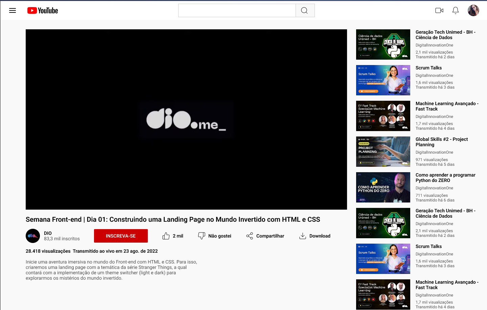

# Desafio : Criando pagina Youtube utilizando Flex Box.

Bem vindo(a) a pagina do youtube criada utilizando o Flex Box para padronização dos componentes em tela.

[Link do Figma](https://www.figma.com/design/lrRWUZPKnqMDZrSDJmZxUS/Desafio-de-Flexbox---DIO?node-id=1-2&t=vic9vckEYqJX0iB9-0) contendo o protótipo do desafio para
que você possa se basear.

